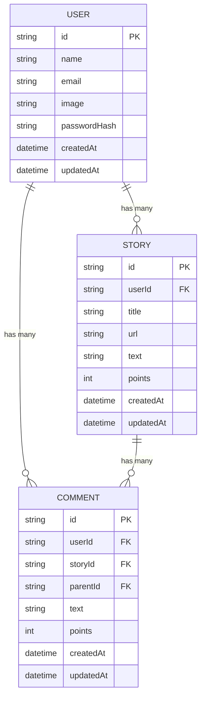

# Hacker News Next.js App Architecture Plan

## Project Overview
A full-featured Hacker News clone with user authentication and commenting functionality using Next.js.

## Technical Stack
- **Framework**: Next.js 14 (App Router)
- **Authentication**: NextAuth.js with OAuth providers
- **Database**: PostgreSQL (for user data and comments)
- **API**: Hacker News official API + custom API routes
- **Styling**: CSS Modules + Tailwind CSS
- **State Management**: React Context + Server Components
- **Deployment**: Vercel-ready configuration

## Project Structure
```
.
├── app/
│   ├── (auth)/
│   ├── (main)/
│   ├── api/
│   ├── components/
│   ├── lib/
│   ├── styles/
│   └── types/
├── public/
├── package.json
├── next.config.js
└── tsconfig.json
```

## Core Features

### 1. Authentication System
- User registration/login with email/password
- OAuth integration (GitHub, Google)
- Session management
- User profiles

### 2. Story Functionality
- Top stories listing
- New stories listing
- Best stories listing
- Story detail view
- Story voting
- Story submission

### 3. Comment System
- Comment threading
- Comment voting
- Comment editing/deletion
- Nested comment replies

### 4. API Integration
- Hacker News API client
- Custom API routes for:
  - Authentication
  - User comments
  - User preferences
  - Search functionality

## Database Schema


## Implementation Plan
1. Set up Next.js project with TypeScript
2. Configure authentication system
3. Create database schema and Prisma setup
4. Implement API routes
5. Build UI components
6. Add styling and responsive design
7. Implement client-side functionality
8. Add testing and deployment configuration